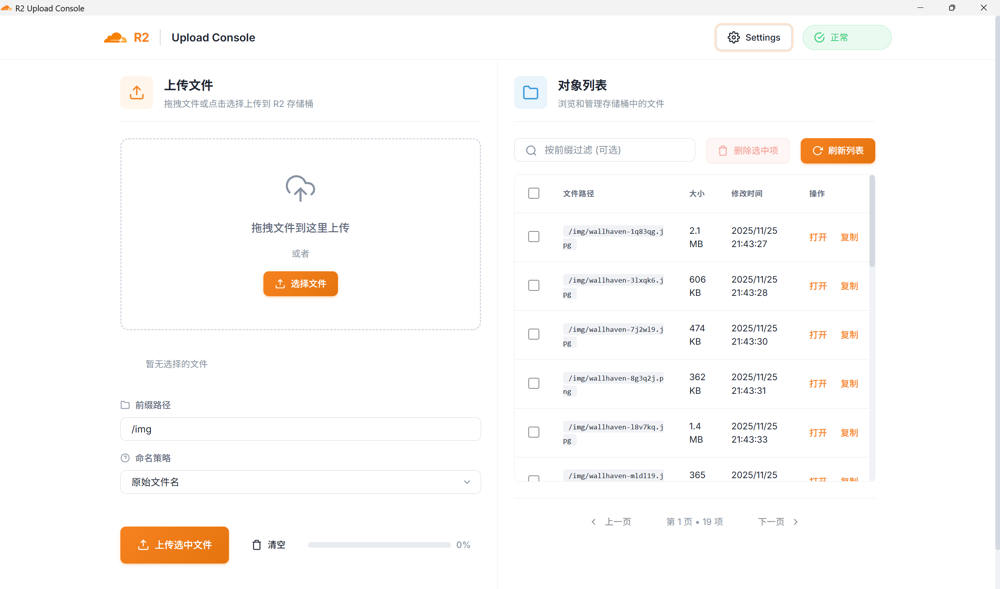

# R2 Upload

English | [中文](README.md)

A Cloudflare R2 file upload management tool with both **Web** and **Desktop GUI** options.

- 🌐 **Web**: Browser uploads directly to R2 via backend server proxy (using presigned URLs)
- 🖥️ **Desktop**: Standalone GUI app, no backend server required, communicates directly with R2



## Features

- ✅ File upload (drag & drop, multiple files)
- ✅ File list browsing with pagination
- ✅ Batch delete files
- ✅ Copy public links
- ✅ Custom prefix paths
- ✅ Hash / Original filename naming strategies
- ✅ Dark/Light theme toggle
- ✅ Cloudflare-style UI

---

## 🖥️ Desktop GUI Client

### Download & Install

Download the latest version from [Releases](https://github.com/willEmber/r2upload/releases):

- **Windows**: `R2 Upload_x.x.x_x64-setup.exe` (NSIS installer) or `R2 Upload_x.x.x_x64_en-US.msi`
- Double-click the installer and follow the prompts

### Configuration

1. Launch the app and click the **Settings** button in the top right corner
2. Fill in R2 storage configuration:

| Field | Description | Example |
|-------|-------------|---------|
| R2 Endpoint | Cloudflare R2 S3 API endpoint | `https://xxxx.r2.cloudflarestorage.com` |
| Access Key ID | R2 API access key ID | `3bc38007e210a...` |
| Secret Access Key | R2 API secret key | `e6f361dd9945...` |
| Bucket Name | R2 Bucket name | `my-bucket` |
| Public Base URL | Optional, for generating public links | `https://res.example.com` |

3. Click **Save Settings**
4. Now you can upload and manage files!

### Getting R2 Credentials

1. Log in to [Cloudflare Dashboard](https://dash.cloudflare.com/)
2. Go to **R2 Object Storage** → **Overview**
3. Click **Manage R2 API Tokens** on the right side
4. Create a new API Token to get:
   - **Access Key ID**
   - **Secret Access Key**
5. Find the **S3 API** endpoint URL in the R2 Bucket settings page

### Build from Source

Requires [Rust](https://rustup.rs/) and [Node.js 18+](https://nodejs.org/):

```bash
# Install dependencies
npm install

# Build desktop app
npm run tauri:build

# Output location
# src-tauri/target/release/r2-upload.exe
# src-tauri/target/release/bundle/nsis/R2 Upload_x.x.x_x64-setup.exe
```

---

## 🌐 Web Version

The web version requires deploying a backend server. R2 credentials are stored in server environment variables for better security.

### Quick Start

```bash
# 1. Clone repository
git clone https://github.com/willEmber/r2upload.git
cd r2upload

# 2. Configure environment variables
cp .env.example .env
# Edit .env with your R2 credentials

# 3. Install dependencies and start
npm install
npm run dev

# 4. Open browser
# http://localhost:3000
```

### Environment Configuration

Edit the `.env` file:

```dotenv
# R2 Storage Config (Required)
R2_ENDPOINT=https://xxxx.r2.cloudflarestorage.com
R2_ACCESS_KEY_ID=your-access-key-id
R2_SECRET_ACCESS_KEY=your-secret-access-key
R2_BUCKET=your-bucket-name

# Optional Config
PUBLIC_BASE_URL=https://res.example.com  # Public access URL
UPLOAD_ENV=dev                            # Upload path prefix
PORT=3000                                 # Server port
ALLOW_ORIGINS=*                           # CORS allowed origins
KEY_STRATEGY=hash                         # Naming strategy: hash or original
```

### Production Deployment

**Direct deployment:**

```bash
npm run build
npm start
```

**Docker deployment:**

```bash
# Build image
docker build -t r2upload .

# Run container
docker run --env-file .env -p 3000:3000 r2upload

# Or use docker-compose
docker compose up --build
```

### API Endpoints

| Method | Path | Description |
|--------|------|-------------|
| POST | `/api/sign-upload` | Get presigned upload URL |
| GET | `/api/objects` | List objects |
| DELETE | `/api/objects/<key>` | Delete object |
| POST | `/api/objects/rename` | Rename object |
| POST | `/api/objects/batch` | Batch operations |
| GET | `/api/objects/<key>/head` | Get object metadata |
| GET | `/api/health` | Health check |

---

## Security Notes

### Desktop Version
- R2 credentials are saved in local `localStorage`, only used on local machine
- Do not save credentials on public computers
- Recommend creating an API Token limited to specific Bucket for desktop use

### Web Version
- **Never commit `.env` file** - excluded in `.gitignore`
- Use specific `ALLOW_ORIGINS` instead of `*` in production
- Use principle of least privilege when creating R2 API Token
- Consider adding Cloudflare Access/WAF protection

### If Credentials Are Accidentally Leaked
1. Immediately revoke/rotate the API Token in Cloudflare Dashboard
2. Check R2 Bucket for unusual access
3. If committed to Git, use `git filter-repo` to clean history

---

## Project Structure

```
r2upload/
├── public/                 # Frontend static files
│   ├── index.html         # Web version entry
│   ├── desktop.html       # Desktop version entry
│   ├── app.js             # Web version JS
│   ├── app-standalone.js  # Desktop version JS
│   └── style.css          # Styles
├── src/                    # Backend source code
│   ├── server.ts          # Express server
│   ├── r2.ts              # R2 operations wrapper
│   ├── config.ts          # Config loader
│   ├── browser/           # Browser-side R2 client
│   └── utils/             # Utility functions
├── src-tauri/             # Tauri desktop app
│   ├── src/               # Rust source code
│   ├── icons/             # App icons
│   └── tauri.conf.json    # Tauri config
├── scripts/               # Build scripts
├── Dockerfile             # Docker build
└── docker-compose.yml     # Docker Compose
```

---

## Tech Stack

- **Backend**: Node.js + TypeScript + Express
- **Frontend**: Vanilla JS + CSS (Cloudflare style)
- **Desktop**: Tauri 2.x + Rust
- **Storage**: Cloudflare R2 (S3-compatible API)
- **SDK**: AWS SDK v3 (@aws-sdk/client-s3)

---

## License

MIT
